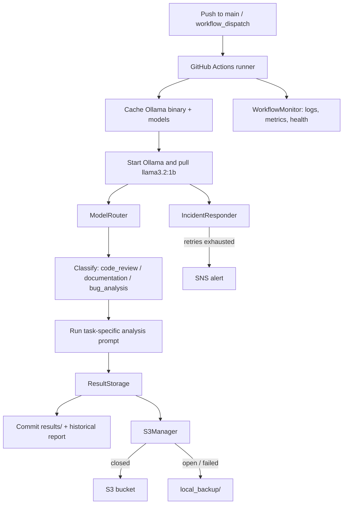

# AI Automation Pipeline

Local LLM inference in GitHub Actions: classify a task, route it to the right model and prompt, then persist results with observability and cloud fallback.

A working system for running [Ollama](https://ollama.com) models in CI, not a notebook demo.

**Stack:** Python · Ollama (`llama3.2:1b`) · GitHub Actions · AWS S3 / SNS · pytest

---

## Why this exists

Most LLM demos stop at a single `ollama run`. Production AI work is the rest of the pipeline: routing, retries, caching, traces, and what happens when S3 is down.

This project treats those as first-class concerns:

| Problem | Approach in this repo |
| --- | --- |
| One model is a poor fit for every task | Fast classifier → task-specific prompt and model |
| CI runners are slow and ephemeral | Cache the Ollama binary and `~/.ollama` models |
| Cloud storage fails mid-run | Circuit breaker + local fallback so artifacts are not lost |
| Failures are hard to debug across steps | Correlation IDs on logs, S3 metadata, and GitHub job summaries |
| “It works on my machine” | Critical vs advisory pytest suite with latency budgets |

---

## Architecture



**Classify-then-analyze.** A cheap model labels the content, then a routed prompt does the real work (code review, docs quality, or bug analysis). Assignments live in `config.yaml`, so swapping models per task does not require workflow changes.

**Fail closed on storage.** `S3Manager.upload_with_protection()` uses a circuit breaker. After repeated S3 failures it fails fast and writes to `local_backup/` instead of dropping artifacts.

**Trace a run.** Each workflow generates a correlation ID, exports it as `CORRELATION_ID`, and stamps logs, S3 object metadata, and the job summary so a single ID follows the run.

---

## What the workflow does

On every push to `main` (or manual dispatch), [`.github/workflows/ollama-basic.yml`](.github/workflows/ollama-basic.yml):

1. Caches the Ollama install and model weights (keyed on `config.yaml`)
2. Starts `ollama serve`, pulls models from config, and retries failed pulls with exponential backoff
3. Runs a monitored pytest suite (critical tests must pass; advisory tests are non-blocking)
4. Benchmarks inference latency and uploads a performance report
5. Classifies the workflow YAML, runs routed analysis, and writes a timestamped `results/run-*` directory
6. Regenerates `results/historical_report.md` from prior runs
7. Uploads artifacts to S3 when AWS credentials are present; otherwise uses local fallback
8. Prints a GitHub Step Summary: test counts, routing decision, cache hits, incidents

---

## Repository layout

```
.github/workflows/ollama-basic.yml   CI pipeline
config.yaml                          Models, prompts, timeouts
ollama_pipeline/                     LLM routing, analysis, result storage
  models.py                          Ollama client + ModelRouter
  analysis.py                        File / repo analysis + markdown reports
  storage.py                         Timestamped result dirs + git commit helpers
  config.py                          YAML config with env overrides
cloud/                               AWS integration
  s3_manager.py                      Upload with circuit breaker + fallback
  circuit_breaker.py                 CLOSED / OPEN / HALF_OPEN
  sns_notifier.py                    Incident alerts with correlation ID
monitoring/                          Observability
  correlation.py                     Request tracing
  logger.py                          Structured JSON + file logs
  dashboard.py                       Health checks and run summaries
  incident_responder.py              Retry then escalate
scripts/                             Test runner and historical reports
tests/                               Service, performance, and reliability tests
results/                             Persisted run outputs
```

---

## Design choices

**Model routing is config, not code.** `config.yaml` maps `code_review`, `documentation`, and `bug_analysis` to models and prompts. `OLLAMA_MODEL` and `OLLAMA_TIMEOUT` override defaults in CI without a commit.

**Heterogeneous models are supported even when CI uses one.** The router always classifies first. Today every assignment is `llama3.2:1b` so GitHub-hosted runners stay fast and cheap; changing a mapping is a one-line YAML edit.

**Tests are split by blast radius.** `@pytest.mark.critical` gates the job (Ollama up, model present, latency under 30s). `@pytest.mark.advisory` covers invalid models, empty prompts, timeouts, and cache warmup — useful signal that must not flake the pipeline.

**Incidents try to self-heal.** `IncidentResponder` retries model pulls with exponential backoff (1s / 2s / 4s) and only escalates to SNS after `max_attempts`.

**Observability is built in, not bolted on.** `WorkflowLogger` writes console, plaintext, and JSON logs with correlation IDs. `WorkflowMonitor` records operation duration, flags threshold breaches, and health-checks disk, logs, and AWS config.

---

## Quick start

**Prerequisites:** Python 3.11+, [Ollama](https://ollama.com/download), Git

```bash
git clone https://github.com/errickbd/ollama-github-actions.git
cd ollama-github-actions

python3 -m venv .venv
source .venv/bin/activate
pip install -r requirements.txt

ollama serve          # in another terminal
ollama pull llama3.2:1b
```

### Run the pipeline locally

```python
from ollama_pipeline import load_config, ModelRouter, ResultStorage

config = load_config()
router = ModelRouter(config)
storage = ResultStorage("results")
run_dir = storage.create_run_directory("local")

result = router.analyze(open(".github/workflows/ollama-basic.yml").read())

if result["success"]:
    storage.save_analysis("workflow-analysis.txt", result["analysis"], {
        "task_type": result["task_type"],
        "model_used": result["model_used"],
        "timing": result["timing"],
    })
    print(result["task_type"], result["model_used"], result["timing"])
```

### Tests

```bash
python scripts/test_runner.py              # smoke: service, model, inference
pytest tests/ -m critical -v               # must-pass CI gate
pytest tests/ -v --tb=short                # full suite
```

### Historical report

```bash
python scripts/generate_report.py --results-dir results --output results/historical_report.md
```

---

## Configuration

Models, prompts, and thresholds live in [`config.yaml`](config.yaml):

```yaml
models:
  classifier: llama3.2:1b
  default: llama3.2:1b

model_assignments:
  code_review: llama3.2:1b
  documentation: llama3.2:1b
  bug_analysis: llama3.2:1b

thresholds:
  max_response_time: 60
  min_response_length: 50
```

| Variable | Effect |
| --- | --- |
| `OLLAMA_MODEL` | Overrides the default analysis model |
| `OLLAMA_TIMEOUT` | Overrides `thresholds.max_response_time` |
| `AWS_ACCESS_KEY_ID` / `AWS_SECRET_ACCESS_KEY` | Enables S3 uploads in CI |
| `AWS_DEFAULT_REGION` | Defaults to `us-east-2` in the workflow |
| `SNS_TOPIC_ARN` | Enables incident alerts |

Without AWS secrets, S3 steps are skipped or fall back to `local_backup/`. The rest of the pipeline still runs.

---

## Reliability patterns

| Pattern | Where | Behavior |
| --- | --- | --- |
| Circuit breaker | `cloud/circuit_breaker.py` | CLOSED → OPEN after 3 failures → HALF_OPEN after timeout |
| Local fallback | `cloud/s3_manager.py` | Writes `local_backup/` + `.meta.json` when S3 is unavailable |
| Exponential backoff | `monitoring/incident_responder.py` | Retries model pull before SNS escalation |
| Correlation IDs | `monitoring/correlation.py` | 8-char ID on logs, env, S3 metadata, job summary |
| Latency SLOs | `tests/test_performance.py` | Inference under 30s (critical); warn above 15s |
